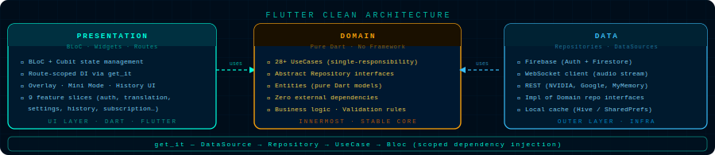

<div align="center">
  
</div>

<p align="center">
  Real-time speech translation, right on your desktop.<br/>
  Capture any audio from your PC or mic, translate it instantly, and see it as a live transparent overlay — no extra hardware required.
</p>

<br/>

<p align="center">
  <a href="https://github.com/Marshal-GG/omni-bridge-translator/releases/latest">
    
  </a>
  &nbsp;&nbsp;
  <a href="https://github.com/Marshal-GG/omni-bridge-translator/releases">
    
  </a>
  &nbsp;&nbsp;
  
  &nbsp;&nbsp;
  
</p>

<br/>

<h3 align="center">
  <sub></sub>&#160; Tech Stack
</h3>


<br/>

<p align="center">
  
</p>

<p align="center">
  <sub>Flutter · Dart &nbsp;—&nbsp; Python backend &nbsp;—&nbsp; Firebase Auth/Firestore &nbsp;—&nbsp; WebSocket real-time bridge &nbsp;—&nbsp; GitHub Actions CI</sub>
</p>

<br/>

<h3 align="center">
  <sub></sub>&#160; Features
</h3>


<br/>

<p align="center">
  
  &nbsp;
  
  &nbsp;
  
  &nbsp;
  
  &nbsp;
  
</p>

<br/>

<div align="center">

**🎙️ Universal Audio Capture** — Translates any audio playing on your PC (videos, calls, streams, meetings). Switch between system audio and microphone with one toggle. Fine-grained volume controls for each source independently.

**🌐 Multiple Speech Recognition Engines**

| Engine | Best For |
|--------|----------|
| **Google Online** | Fast, no setup required |
| **NVIDIA Riva** | ⭐ Recommended — High-accuracy multilingual (API key needed) |
| **Whisper Offline** | Privacy-first, works without internet |

<sub>Whisper comes in 4 sizes — **Tiny, Base, Small, and Medium** — downloadable directly from the Settings panel.</sub>

**🔤 Multiple Translation Engines**

| Engine | Notes |
|--------|-------|
| **Llama 3.1 8B** | ⭐ Recommended — AI-powered, context-aware, accurate |
| **Google Translate** | Free, fast, 100+ languages, no setup required |
| **Google Cloud (v3)** | Professional grade gRPC translation (Service Account needed) |
| **MyMemory** | Free alternative, no key needed |
| **NVIDIA Riva NMT** | High-quality neural translation |

**🪟 Transparent Always-on-Top Overlay** — Fully draggable and resizable. Collapse to **Mini Mode** for a single caption line. Adjustable opacity, font size, **bold toggle**, and **Uncensored Mode** to bypass profanity filters.

**📜 Caption History** — Every translated caption is saved to a searchable, premium History Panel with a glassy dark aesthetic. Contextual upgrade prompts guide free-tier users to premium.

**👤 Account & Sync** — Sign in with Google, Email/Password, or as Guest. Settings sync to the cloud. Remote device management, real-time usage dashboard, and Razorpay-powered subscriptions.

</div>

<br/>

<h3 align="center">
  <sub></sub>&#160; How It Works
</h3>


<br/>

<div align="center">
  
</div>

<br/>


<h3 align="center">
  <sub></sub>&#160; Download &amp; Install
</h3>


<br/>

<div align="center">


<ol align="left">
  <li>Go to the <a href="https://github.com/Marshal-GG/omni-bridge-translator/releases"><strong>Releases page</strong></a></li>
  <li>Download <code>OmniBridge_Setup.exe</code></li>
  <li>Run the installer — it bundles everything (Python server + UI)</li>
  <li>Launch <strong>Omni Bridge</strong> from your Start Menu or Desktop</li>
</ol>

<details>
<summary><b>System Requirements</b></summary>
<br/>

| Component | Minimum |
|-----------|---------|
| **OS** | Windows 10 64-bit or higher |
| **RAM** | 4 GB minimum · 8 GB recommended |
| **Storage** | ~200 MB + optional Whisper models (75 MB – 1.5 GB each) |
| **Internet** | Required for Google Translate & NVIDIA cloud engines |
| **GPU** | Optional — NVIDIA GPU unlocks Riva engine acceleration |

</details>

</div>

<br/>

<h3 align="center">
  <sub></sub>&#160; Quick Start
</h3>


<br/>

```bash
# 1. Launch   →  Omni Bridge from Start Menu (or run start_server.bat from source)
# 2. Sign In  →  Google, Email, or continue as Guest
# 3. Settings →  Choose Speech Recognition & Translation Engine + Target Language
# 4. Done     →  Captions appear live as audio plays on your PC
```

<div align="center">

> That's it. No complex configuration needed for the default Google setup.

**Using NVIDIA API Key** — Get a free key at [build.nvidia.com](https://build.nvidia.com), open Settings → Translation Engine, paste your key, then select NVIDIA Riva or Llama.

</div>

<br/>

<h3 align="center">
  <sub></sub>&#160; Architecture
</h3>


<br/>

<div align="center">
  
</div>

<br/>

<div align="center">
  
</div>

<br/>

<details>
<summary><b>View full project tree</b></summary>
<br/>

```
Flutter Client (Clean Architecture)
  ├── Feature slices    — auth, translation, settings, history, subscription,
  │                       startup, about, usage, support
  ├── Domain Layer      — Entities, abstract Repositories, 28+ UseCases
  ├── Data Layer        — RemoteDataSources (Firebase, WebSocket, REST)
  ├── Presentation      — BLoC pattern, route-scoped injection
  └── DI                — get_it: DataSource → Repository → UseCase → Bloc

Python Backend
  ├── Orchestration     — session lifecycles, async task queues
  ├── Inference Pipeline — modular ASR + Translation with fallback
  ├── Model Layer       — NVIDIA Riva, Whisper, Llama 3.1, Google Cloud
  ├── Communication     — high-performance WebSocket bidirectional data flow
  └── Verification      — pytest suite with AI engine mocking
```

</details>

<br/>

<h3 align="center">
  <sub></sub>&#160; Subscription Tiers
</h3>


<br/>

<details>
<summary><b>View full tier comparison</b></summary>
<br/>

| Feature | **Free** | **Pro** ₹799/mo | **Enterprise** ₹2,499/mo |
|---------|:--------:|:--------------:|:------------------------:|
| Daily Quota | 5,000 tokens | 25,000 tokens | 75,000 tokens |
| Monthly Quota | 50,000 tokens | 250,000 tokens | 750,000 tokens |
| Translation Engines | Google, MyMemory | All | All |
| Transcription | Google Online | + Whisper tiny–small | + Whisper medium, Riva |
| Microphone Audio | — | ✓ | ✓ |
| Caption History | — | 7-day | 30-day |
| Session Duration | 15 min | 2 hours | 8 hours |
| Concurrent Sessions | 1 | 2 | 5 |

<p><sub>Usage counts input + output tokens across all engines. A one-time <strong>Trial</strong> tier is available for new users to test Pro-level features. Users with their own <strong>NVIDIA API Key</strong> bypass the daily quota for NVIDIA-backed engines.</sub></p>

</details>

<br/>

<h3 align="center">
  <sub></sub>&#160; Documentation
</h3>


<br/>

<p align="center">
  Full architecture diagrams, feature guides, and maintenance playbooks in <code>docs/</code> — start with the <a href="docs/00_doc_index.md">Master Documentation Index →</a>
</p>

<br/>

<div align="center">
  
  &nbsp;&nbsp;
  <a href="https://github.com/Marshal-GG/omni-bridge-translator/releases">
    
  </a>
  &nbsp;&nbsp;
  <a href="docs/00_doc_index.md">
    
  </a>
  &nbsp;&nbsp;
  <a href="https://github.com/Marshal-GG/omni-bridge-translator/issues/new?labels=bug">
    
  </a>
</div>

<br/>

<div align="center">
  
</div>

<div align="center">
  Made with ❤️ by <a href="https://github.com/Marshal-GG">Marshal-GG</a>
  &nbsp;·&nbsp;
  <a href="https://github.com/Marshal-GG/omni-bridge-translator/issues">Report a Bug</a>
  &nbsp;·&nbsp;
  <a href="https://github.com/Marshal-GG/omni-bridge-translator/issues">Request a Feature</a>
  &nbsp;·&nbsp;
  <a href="https://github.com/Marshal-GG/omni-bridge-translator/releases">Changelog</a>
</div>
