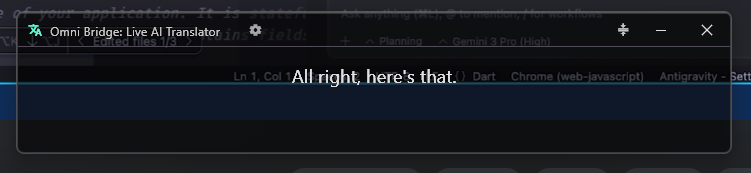
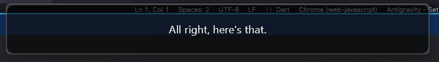
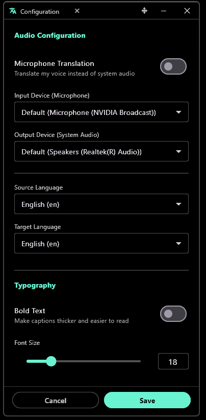

# Omni Bridge — Live AI Translator

> **Real-time speech translation, right on your desktop.**  
> Capture any audio from your PC or mic, translate it instantly, and see it as a live transparent overlay — no extra hardware required.

---

| Translator Overlay | Mini Mode |
| :---: | :---: |
|  |  |

| Settings Panel |
| :---: |
|  |

---

## ✨ Features

### 🎙️ Universal Audio Capture
- Translates **any audio playing on your PC** — videos, calls, streams, meetings
- Switch between **system audio** and **microphone** with one toggle
- Fine-grained **volume controls** for desktop and mic independently

### 🌐 Multiple Speech Recognition Engines
| Engine | Best For |
|--------|----------|
| **Google Online** | Fast, no setup required |
| **NVIDIA Riva** | High-accuracy multilingual (API key needed) |
| **Whisper Offline** | Privacy-first, works without internet |

Whisper comes in 4 sizes — **Tiny, Base, Small, and Medium** — downloadable directly from the Settings panel.

### 🔤 Multiple Translation Engines
| Engine | Notes |
|--------|-------|
| **Google Translate** | Recommended — free, fast, 100+ languages |
| **MyMemory** | Free alternative, no key needed |
| **NVIDIA Riva NMT** | High-quality neural translation |
| **Llama 3.1 8B** | AI-powered, great for context-aware translations |

### 🗣️ 20+ Languages Supported
Auto-detect source language, or manually select from: English, Spanish, French, German, Chinese, Japanese, Korean, Russian, Portuguese, Italian, Arabic, Hindi, Dutch, Turkish, Vietnamese, Polish, Indonesian, Thai, Bengali, and more.

### 🪟 Transparent Always-on-Top Overlay
- Fully **draggable, resizable** transparent overlay — stays above all windows
- **Collapse to Mini Mode** — single caption line that takes up minimal screen space
- **Adjustable opacity** and font size from Settings
- **Bold text** toggle for better readability

### 📜 Caption History
- Every translated caption is saved to a searchable **History Panel**
- Review past translations any time without interrupting the live session

### 🔄 Auto-Update
- Built-in update checker — get notified when a new version is available
- Update badge appears right in the overlay header

### 👤 Account & Sync
- Sign in with **Google**, **Email/Password**, or use as **Guest**
- Settings sync to the cloud — your preferences follow you
- Session activity and translation usage are tracked securely per device

### 💳 Subscription Tiers

| Tier | Price | Daily Quota |
|------|-------|-------------|
| **Free** | ₹0 | 10,000 chars/day |
| **Weekly** | ₹49/week | 50,000 chars/day |
| **Plus** | ₹149/month | 100,000 chars/day |
| **Pro** | ₹399/month | Unlimited |

Pro unlocks **Intelligent Context Refresh** (5-second retroactive correction), unlimited history, and priority support. Upgrade from within the app via Razorpay.

> Users with their own NVIDIA API Key bypass the daily quota for NVIDIA-backed engines.

---

## ⬇️ Download & Install

### Option 1 — Installer (Recommended)

1. Go to the [**Releases page**](https://github.com/Marshal-GG/omni-bridge-translator/releases/latest)
2. Download **`OmniBridge_Setup.exe`**
3. Run the installer — it bundles everything (Python server + UI)
4. Launch **Omni Bridge** from your Start Menu or Desktop

> No Python or Flutter installation required when using the installer.

### Option 2 — Run from Source

See [Developer Setup →](docs/developer_setup.md)

---

## 🚀 Quick Start

1. **Launch** Omni Bridge from Start Menu (or run `start_server.bat` if running from source)
2. **Sign in** with Google, Email, or continue as Guest
3. **Open Settings** (gear icon or click the `auto → en` language badge in the header)
4. Choose your **Speech Recognition** and **Translation Engine**
5. Select your **Target Language**
6. **Close Settings** — captions appear live as audio plays on your PC

That's it. No complex configuration needed for the default Google setup.

---

## ⚙️ Using an NVIDIA API Key

For NVIDIA Riva ASR / NMT or Llama translation:
1. Get a free API key at [build.nvidia.com](https://build.nvidia.com)
2. Open **Settings → Translation Engine** and paste your key
3. Select **NVIDIA Riva** or **Llama** as your engine

---

## ❓ Troubleshooting

| Issue | Solution |
|-------|----------|
| No captions appearing | Make sure the server is running (tray icon or `start_server.bat`) |
| Google Sign-In redirect fails | See [Google Auth Troubleshooting](docs/google_auth_troubleshooting.md) |
| Whisper model not working | Download it in **Settings → Transcription Method → Whisper Offline** |
| Audio not captured | Check that your audio device is set as the Windows default playback device |

---

## 🛠️ For Developers

- [Flutter Architecture](docs/flutter_architecture.md)
- [Python Server Architecture](docs/python_architecture.md)
- [Database Schema](docs/database_schema.md)
- [Monetization Plan](docs/monetization_plan.md)
- [Google Auth Troubleshooting](docs/google_auth_troubleshooting.md)
- [Publishing a New Release](docs/github_releases_guide.md)
- [Developer Setup](docs/developer_setup.md)

---

## 📄 License

MIT — see [LICENSE](LICENSE) for details.

---

Made with ❤️ · [Report a Bug](https://github.com/Marshal-GG/omni-bridge-translator/issues) · [Request a Feature](https://github.com/Marshal-GG/omni-bridge-translator/issues)

