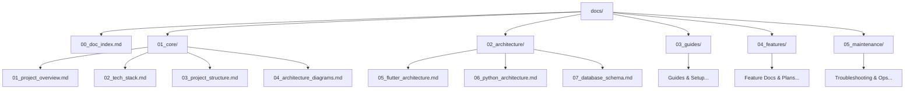
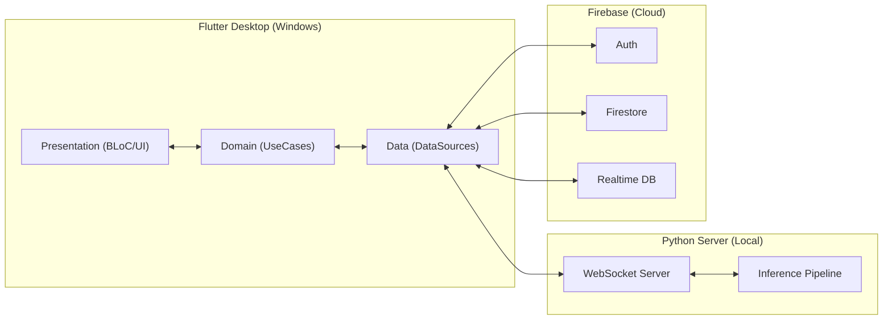

# 04 — Architecture Diagrams

> High-level visual representations of the Omni Bridge system architecture and data flow.

## System Overview

```mermaid
graph TD
    DOCS["docs/"] --> INDEX["00_doc_index.md"]
    DOCS --> CORE["01_core/"]
    DOCS --> ARCH["02_architecture/"]
    DOCS --> GUIDES["03_guides/"]
    DOCS --> FEAT["04_features/"]
    DOCS --> MAINT["05_maintenance/"]

    CORE --> P1["01_project_overview.md"]
    CORE --> P2["02_tech_stack.md"]
    CORE --> P3["03_project_structure.md"]
    CORE --> P4["04_architecture_diagrams.md"]

    ARCH --> P5["05_flutter_architecture.md"]
    ARCH --> P6["06_python_architecture.md"]
    ARCH --> P7["07_database_schema.md"]

    GUIDES --> G1["Guides & Setup..."]
    FEAT --> F1["Feature Docs & Plans..."]
    MAINT --> M1["Troubleshooting & Ops..."]
```

## Component Interconnection

```mermaid
graph LR
    subgraph "Flutter Desktop (Windows)"
        UI["Presentation (BLoC/UI)"]
        UseCase["Domain (UseCases)"]
        Data["Data (DataSources)"]
    end

    subgraph "Python Server (Local)"
        Pipe["Inference Pipeline"]
        WS["WebSocket Server"]
    end

    subgraph "Firebase (Cloud)"
        Auth["Auth"]
        FS["Firestore"]
        RTDB["Realtime DB"]
    end

    UI <--> UseCase
    UseCase <--> Data
    Data <--> WS
    WS <--> Pipe
    Data <--> Auth
    Data <--> FS
    Data <--> RTDB
```
