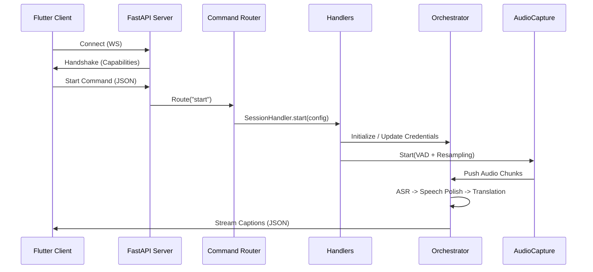

# Python Server Architecture

## Overview

The Python server is the local backend for Omni Bridge. It captures system audio (or microphone), runs ASR (Automatic Speech Recognition) and translation, and streams results to the Flutter UI via WebSocket.

The server uses an **Asynchronous Modular Architecture** built on **FastAPI** and **uvicorn**, allowing for high-concurrency WebSocket management and non-blocking command execution.

---

## Directory Structure

```
server/
├── src/
│   ├── pipeline/
│   └── orchestrator.py     # Coordination layer delegating to specialized dispatchers
├── asr/
│   └── asr_dispatcher.py   # selection of ASR models & silence gating
├── translation/
│   └── translation_dispatcher.py # Language detection & comprehensive fallback trees
├── audio/
│   ├── capture.py          # WASAPI loopback + mic capture (pyaudiowpatch) with VAD
│   ├── handler.py          # caption_callback, audio_poll_loop, levels
│   ├── meter.py            # RMS metering (dB-normalized 0.0–1.0)
│   └── shared_pyaudio.py   # Thread-safe global PyAudio singleton
├── network/
│   ├── handlers/           # Modular command handlers
│   │   ├── base_handler.py     # Shared BaseHandler and ServerContext
│   │   ├── session_handler.py  # Session lifecycle (start/stop)
│   │   ├── config_handler.py   # Settings and Volume management
│   │   ├── device_handler.py   # Audio device enumeration
│   │   └── status_handler.py   # Health and model status reporting
│   ├── ws_manager.py       # WebSocket connection management
│   └── router.py           # Command routing (Decouples WS from logic)
│   ├── utils/
│   │   ├── server_utils.py     # structlog setup, process management
│   │   └── language_support.py # Single source of truth for language capabilities
│   └── models/                 # Low-level model implementation wrappers
│       ├── asr/                # Riva ASR, Whisper, Google ASR
│       └── translation/        # Riva NMT, Llama, Google, MyMemory
├── tests/                      # Pytest unit testing suite
│   ├── conftest.py             # Shared fixtures and AI model mocks
│   ├── test_asr_dispatcher.py
│   ├── test_translation_dispatcher.py
│   └── test_orchestrator.py
├── flutter_server.py           # FastAPI Entry point
└── pyproject.toml              # Dependency management (includes pytest)
```

---

## Key Components

### `flutter_server.py` & `ServerContext`
The server uses a **Dependency Injection**-like pattern via `ServerContext`.
- **ServerContext**: Encapsulates all global state (orchestrator, audio capture, metering, active config). This prevents "global variable hell" and ensures thread safety.
- **Capabilities Handshake**: Upon WebSocket connection, the server immediately emits a `capabilities` message detailing GPU availability, VRAM, and authenticated AI engines.

### Command Routing (`router.py` & Modular Handlers)
Incoming JSON commands are dispatched by the `CommandRouter` to specialized modular handlers in `src/network/handlers/`:
- **SessionHandler** (`session_handler.py`): Manages the lifecycle of an audio session (`start`/`stop`). It calculates the optimal audio chunk duration based on the selected AI engines to balance latency vs. API rate limits.
- **ConfigHandler** (`config_handler.py`): Updates settings (languages, keys, devices) in real-time. If settings change during an active session, it triggers a seamless restart.
- **DeviceHandler** (`device_handler.py`): Enumerates WASAPI input and loopback devices for the Flutter UI.
- **StatusHandler** (`status_handler.py`): Manages real-time health reporting. It provides standardized status payloads for both background broadcasting and on-demand HTTP polling.

### Audio Pipeline (`capture.py` & `meter.py`)
- **Adaptive Chunking**: `AudioCapture` uses a combination of **Voice Activity Detection (VAD)** and time-based flushing. It flushes early when silence follows speech (lowering latency) but guarantees a flush at `MAX_CHUNK_DURATION` to ensure constant feedback.
- **Volume Scaling**: Real-time gain application for both Mic and Desktop audio before mixing.
- **Dual Metering**: `AudioMeter` runs independent threads to provide RMS levels for both microphone and system output, used by the UI volume visualizers.

### Language Support (`utils/language_support.py`)
Single source of truth for all model language capabilities — imported by both models and the orchestrator. No model defines its own language sets.

| Constant | Purpose |
|---|---|
| `LANG_TO_BCP47` | Maps 23 app language codes (`"hi"` → `"hi-IN"`, `"he"` → `"he-IL"`, `"da"` → `"da-DK"`, `"cs"` → `"cs-CZ"`, `"sv"` → `"sv-SE"`, etc.) to BCP-47 for Riva ASR configs |
| `RIVA_PARAKEET_ASR_LANGS` | BCP-47 codes routed to the Parakeet model (includes `en-US`, `es-US`, `fr-FR`, `de-DE`, `it-IT`, `ar-AR`, `ko-KR`, `pt-BR`, `ru-RU`, `hi-IN`, `nl-NL`, `da-DK`, `cs-CZ`, `pl-PL`, `sv-SE`, `th-TH`, `tr-TR`, `he-IL`, `bn-IN`, and more); all others (including `"multi"` for auto-detect) go to Canary |
| `RIVA_NMT_LANGS` | App-level codes supported by Riva NMT: `en, de, es, fr, pt, ru, zh, ja, ko, ar` (both source and target must be in this set) |
| `GOOGLE_FREE_LANGS` / `GOOGLE_CLOUD_LANGS` / `MYMEMORY_LANGS` / `LLAMA_LANGS` | `None` — these models are unrestricted within the app language list |

### AI Orchestration (`orchestrator.py`)
Acts as a high-level coordinator that delegates specialized tasks to dedicated dispatchers. It transforms raw audio chunks from the frontend into polished, translated captions while managing the complex lifecycle of AI models.

- **`ASRDispatcher`** (`src/asr/asr_dispatcher.py`):
  - **Model Selection**: Routes audio to Riva, Faster-Whisper, or Google based on configuration and availability.
  - **Silence Gating**: Calculates RMS and drops chunks < 120 RMS to prevent "hallucinations" during silence.
  - **Confidence Filtering**: Discards Riva results with confidence < 0.5.
- **`TranslationDispatcher`** (`src/src/translation/translation_dispatcher.py`):
  - **Fallback Trees**: Implements the multi-stage fallback logic (e.g., Riva -> Llama -> Google Free).
  - **Language Detection**: Orchestrates detection using specialized scripts or model-native capabilities.
- **Background Thread Stability**: Implements a "Thread-Safe Queue" pattern ensuring background worker threads (ASR/Translation) can safely communicate results back to the FastAPI event loop.
- **Speech Polishing**: Employs `pysbd` for sentence segmentation and a custom deduplication algorithm to remove stutters and repetitive phrases.
- **Queue Resilience**: Worker threads use non-blocking queue polling with timeouts to prevent deadlock or high CPU usage during idle periods.
### Audio Handler (`handler.py`)
Bridges the async FastAPI event loop with background worker threads:
- **`caption_callback()`** — Called by orchestrator for each transcript/translation. Broadcasts caption JSON to all WebSocket clients and calculates total tokens from engine-specific metrics.
- **`audio_poll_loop()`** — Background thread that polls audio chunks from `AudioCapture` and feeds them to the orchestrator. Detects session superseding for clean restarts.
- **`audio_level_broadcast_loop()`** — Async coroutine broadcasting RMS audio levels to clients (~13 fps).
- **`status_broadcast_loop()`** — Async coroutine broadcasting model health status every 2 seconds.

---

## WebSocket Message Protocol

### Messages Sent to Clients

| Type | Purpose | Key Fields |
|---|---|---|
| `capabilities` | Sent on connect | `has_gpu`, `gpu_name`, `vram_gb`, `has_google_auth`, `has_nvidia_auth`, `whisper_models` |
| `caption` | Transcript/translation result | `text`, `original`, `is_final`, `session_id` |
| `usage_stats` | Per-call engine metrics | `engine`, `model`, `latency_ms`, `input_tokens`, `output_tokens`, `total_tokens` |
| `audio_levels` | Real-time RMS levels | `input_level` (0.0–1.0), `output_level` (0.0–1.0) |
| `model_status` | Model health broadcast | `models[]` with `name`, `status`, `ready`, `progress`. Polled via model-specific `get_status()` methods (e.g., `RivaASRModel.get_status()` returns availability and error state). |
| `error` | Error message | `text`, `is_final`, `original` |

### Commands Received from Clients

| Command | Purpose | Key Fields |
|---|---|---|
| `start` | Begin audio session | `source`, `target`, `transcription_model`, `translation_model`, `use_mic`, `api_key`, `google_credentials_json` |
| `stop` | End audio session | (none) |
| `settings_update` | Change settings mid-session | Same as `start` (triggers restart if running) |
| `volume_update` | Adjust gain in real-time | `desktop_volume`, `mic_volume` |
| `list_devices` | Enumerate WASAPI devices | (none) |

---

## Data Flow



### Google Cloud Credentials Pipeline

The `google_cloud_model.py` module uses the **Google Cloud Translation gRPC v3** API (`google.cloud.translate_v3.TranslationServiceClient`). Credentials flow:

1. Flutter sends the full service account JSON string via WebSocket (`google_credentials_json` key).
2. `ConfigHandler` passes it to `InferenceOrchestrator.set_api_keys()`.
3. `GoogleCloudModel.reload()` parses the JSON with `json.loads()`, extracts `project_id`, and creates a gRPC client via `service_account.Credentials.from_service_account_info()`.
4. Error handling is sanitized — `json.JSONDecodeError` logs a generic message, other exceptions log only `type(e).__name__` to prevent credential leakage in logs.

---

## Resilient Fallback Strategy

The `InferenceOrchestrator` implements a priority-based fallback system:

1. **Transcription**:
   - `riva` (High Quality/Low Latency) — routes to Parakeet or Canary based on `RIVA_PARAKEET_ASR_LANGS`.
   - `whisper` (Local Fallback - Small/Medium).
   - `google` (Online Fallback - Universal).

2. **Translation**:
   - **Riva**: First choice for supported pairs (`RIVA_NMT_LANGS`). Falls back to Llama on failure or unsupported language.
   - **Llama (NVIDIA NIM)**: Universal high-quality translator. Falls back to MyMemory or Google Free.
   - **Google Cloud (v3 gRPC)**: Enterprise-grade translation. Falls back to Google Free on quota/auth issues.
   - **MyMemory / Google Free**: Public REST API fallbacks used when API keys are missing or premium quotas are exhausted.
   - **Silent Drop**: If all models in the chain fail, the caption is discarded rather than broadcasting broken/untranslated text.

---

## Testing Infrastructure

The server includes a robust unit test suite located in `server/tests/` using **pytest**.

### Key Features:
- **Mocked AI Models**: Riva, Llama, and Google models are fully mocked to allow "offline" testing.
- **Shared Fixtures**: `conftest.py` provides standardized orchestrator and dispatcher instances.
- **Component Isolation**: Each dispatcher is tested independently before testing their integration in the `InferenceOrchestrator`.

### Running Tests:
```bash
cd server
pytest
```
---

## Observability

The server implements structured JSON logging and standard console logging via `server_utils.py`.
- **Log Levels**: 
    - `INFO` (Default): Shows high-level events (server boot, model status, session starts/stops).
    - `DEBUG`: Shows per-event results (ASR completion, Translation stats). Enable with `OMNI_BRIDGE_DEBUG=true`.
- **Log Files**: Located in `logs/server.log` (local) or `%LOCALAPPDATA%\OmniBridge\logs\server.log` (frozen/prod).
- **Latency Tracking**: Every ASR and Translation event logs its processing time and model used at the `DEBUG` level.

---

## Health & Status Endpoints

The server provides **RESTful HTTP endpoints** alongside its primary WebSocket channel for monitoring:

- **`GET /status`**: Returns basic server availability, session info, and the number of active WebSocket clients.
- **`GET /models/status`**: Returns a detailed health manifest of all AI engines (NVIDIA NIM, Faster-Whisper, Google Cloud), including GPU/VRAM utilization and model readiness.
- **`GET /devices`**: Returns available WASAPI audio input and loopback devices (mirrors the WebSocket `get_devices` command).
- **`POST /whisper/unload`**: Unloads the Faster-Whisper model from GPU/RAM to reclaim memory when not in use.

---

## Modular Package Design & API Contracts

To maintain a clean architecture and prevent circular dependencies, the server enforces explicit API contracts in each package's `__init__.py`:

1.  **Explicit Exports**: Every package (e.g., `src/audio/`, `src/network/handlers/`) must explicitly export its public classes and functions in its `__init__.py`.
2.  **Circular Dependency Prevention**: Logic is kept in dedicated modules (e.g., `src/network/handlers/session_handler.py`), and `__init__.py` only serves as a re-export layer. This ensures that internal modules can import each other without triggering circular paths through the package root.
3.  **Discovery**: Developers should always import from the package level (e.g., `from src.audio import AudioCapture`) rather than reaching into sub-modules directly, preserving the internal encapsulation.
