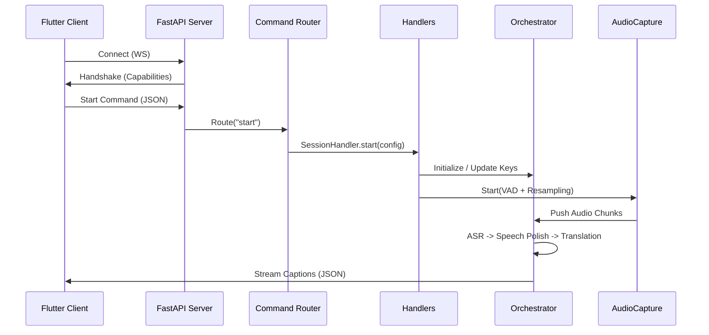

# Python Server Architecture

## Overview

The Python server is the local backend for Omni Bridge. It captures system audio (or microphone), runs ASR (Automatic Speech Recognition) and translation, and streams results to the Flutter UI via WebSocket.

The server uses an **Asynchronous Modular Architecture** built on **FastAPI** and **uvicorn**, allowing for high-concurrency WebSocket management and non-blocking command execution.

---

## Directory Structure

```
server/
├── src/
│   ├── audio/
│   │   ├── capture.py          # WASAPI loopback + mic capture (pyaudiowpatch) with VAD
│   │   ├── handler.py          # Audio status callbacks and broadcasting
│   │   ├── meter.py            # Real-time independent RMS metering for Mic & Output
│   │   └── shared_pyaudio.py   # Global PyAudio instance management
│   ├── network/
│   │   ├── orchestrator.py     # Core AI pipeline & Speech Polishing
│   │   ├── ws_manager.py       # WebSocket connection & heartbeat management
│   │   ├── router.py           # Command routing (Decouples WS from logic)
│   │   └── handlers.py         # Specialized command logic (Session, Device, Config, Status)
│   ├── utils/
│   │   ├── server_utils.py     # structlog setup, process management, JSON detection
│   │   └── language_support.py # Single source of truth for all model language support
│   └── models/
│       ├── riva_model.py       # NVIDIA NIM (Riva) ASR + NMT Wrapper
│       ├── llama_model.py      # NVIDIA NIM (Llama 3.1 8B) Translation Wrapper
│       ├── whisper_model.py    # Local Faster-Whisper management
│       ├── google_model.py     # Google Translate (Free/Scraping)
│       ├── google_cloud_model.py # Official Google Cloud Translation API
│       └── ...                 # Other inference wrappers (MyMemory, SpeechRecognition)
├── flutter_server.py           # FastAPI Entry point & Handshake
└── pyproject.toml              # Modern dependency management
```

---

## Key Components

### `flutter_server.py` & `ServerContext`
The server uses a **Dependency Injection**-like pattern via `ServerContext`.
- **ServerContext**: Encapsulates all global state (orchestrator, audio capture, metering, active config). This prevents "global variable hell" and ensures thread safety.
- **Capabilities Handshake**: Upon WebSocket connection, the server immediately emits a `capabilities` message detailing GPU availability, VRAM, and authenticated AI engines.

### Command Routing (`router.py` & `handlers.py`)
Incoming JSON commands are dispatched by the `CommandRouter` to specialized handlers:
- **SessionHandler**: Manages the lifecycle of an audio session (`start`/`stop`). It calculates the optimal audio chunk duration based on the selected AI engines to balance latency vs. API rate limits.
- **ConfigHandler**: Updates settings (languages, keys, devices) in real-time. If settings change during an active session, it triggers a seamless restart.
- **DeviceHandler**: Enumerates WASAPI input and loopback devices for the Flutter UI.
- **StatusHandler**: Manages real-time health reporting. It provides standardized status payloads for both background broadcasting and on-demand HTTP polling.

### Audio Pipeline (`capture.py` & `meter.py`)
- **Adaptive Chunking**: `AudioCapture` uses a combination of **Voice Activity Detection (VAD)** and time-based flushing. It flushes early when silence follows speech (lowering latency) but guarantees a flush at `MAX_CHUNK_DURATION` to ensure constant feedback.
- **Volume Scaling**: Real-time gain application for both Mic and Desktop audio before mixing.
- **Dual Metering**: `AudioMeter` runs independent threads to provide RMS levels for both microphone and system output, used by the UI volume visualizers.

### Language Support (`utils/language_support.py`)
Single source of truth for all model language capabilities — imported by both models and the orchestrator. No model defines its own language sets.

| Constant | Purpose |
|---|---|
| `LANG_TO_BCP47` | Maps app language codes (`"hi"`) to BCP-47 (`"hi-IN"`) for Riva ASR configs |
| `RIVA_PARAKEET_ASR_LANGS` | BCP-47 codes routed to the Parakeet model; all others go to Canary |
| `RIVA_NMT_LANGS` | App-level codes supported by Riva NMT (both source and target must be in this set) |
| `GOOGLE_FREE_LANGS` / `GOOGLE_CLOUD_LANGS` / `MYMEMORY_LANGS` / `LLAMA_LANGS` | `None` — these models are unrestricted within the app language list |

### AI Orchestration (`orchestrator.py`)
Coordinates transcription and translation across multiple concurrent workers.
- **Background Thread Stability**: Implements a robust "Event Loop Capturing" pattern to ensure background threads can safely schedule callbacks in the main FastAPI loop.
- **Queue Resilience**: Worker threads gracefully handle `queue.Empty` timeouts, preventing crashes during periods of silence.
- **Chunk Duration Logic**: Dynamically calculates the optimal audio chunk duration based on how many NVIDIA NIM models are active (1.5s for 0–1 NIM models; 3.0s for 2 NIM models) to stay within API rate limits.
- **Speech Polishing**: Employs `pysbd` to segment text and a deduplication algorithm.
- **ASR Hallucination Prevention** (three-layer defence):
  1. **RMS Gate** — chunks with RMS < 120 are dropped before reaching ASR, preventing silence hallucinations.
  2. **Confidence Filter** — Riva results with confidence < 0.5 are discarded at the model level.
  3. **Time-Window Deduplication** — identical transcripts within a 6-second window are suppressed; real speech passes once the window expires.

---

## Data Flow



---

## Resilient Fallback Strategy

The `InferenceOrchestrator` implements a priority-based fallback system:

1. **Transcription**:
   - `riva` (High Quality/Low Latency) — routes to Parakeet or Canary based on `RIVA_PARAKEET_ASR_LANGS`
   - `whisper` (Local Fallback - Small/Medium)
   - `online` (Google Speech Recognition - Universal Fallback)

2. **Translation** — clean separation of concerns:
   - Each model (`riva_model`, `llama_model`) only executes its own engine and **raises** on failure.
   - All routing and fallback logic lives exclusively in `orchestrator._dispatch_translation()`.
   - `google_api` → `google` (free) on failure
   - `riva` — pre-checks `RIVA_NMT_LANGS`; if unsupported pair, goes directly to `llama`. If Riva call itself fails, falls back to `llama`. If `llama` also fails, caption is **silently dropped** (never broadcasts original text).
   - `google` (free) → `llama` on failure
   - `llama` — raises on any failure; orchestrator drops caption cleanly.

---

## Observability

The server implements structured JSON logging and standard console logging via `server_utils.py`.
- **Log Levels**: 
    - `INFO` (Default): Shows high-level events (server boot, model status, session starts/stops).
    - `DEBUG`: Shows per-event results (ASR completion, Translation stats). Enable with `OMNI_BRIDGE_DEBUG=true`.
- **Log Files**: Located in `logs/server.log` (local) or `%LOCALAPPDATA%\OmniBridge\logs\server.log` (frozen/prod).
- **Latency Tracking**: Every ASR and Translation event logs its processing time and model used at the `DEBUG` level.

---

## Health & Status Endpoints

The server provides **RESTful HTTP endpoints** alongside its primary WebSocket channel for monitoring:

- **`GET /status`**: Returns basic server availability, session info, and the number of active WebSocket clients.
- **`GET /models/status`**: Returns a detailed health manifest of all AI engines (NVIDIA NIM, Faster-Whisper, Google Cloud), including GPU/VRAM utilization and model readiness.
- **`GET /devices`**: Returns available WASAPI audio input and loopback devices (mirrors the WebSocket `get_devices` command).
- **`POST /whisper/unload`**: Unloads the Faster-Whisper model from GPU/RAM to reclaim memory when not in use.
