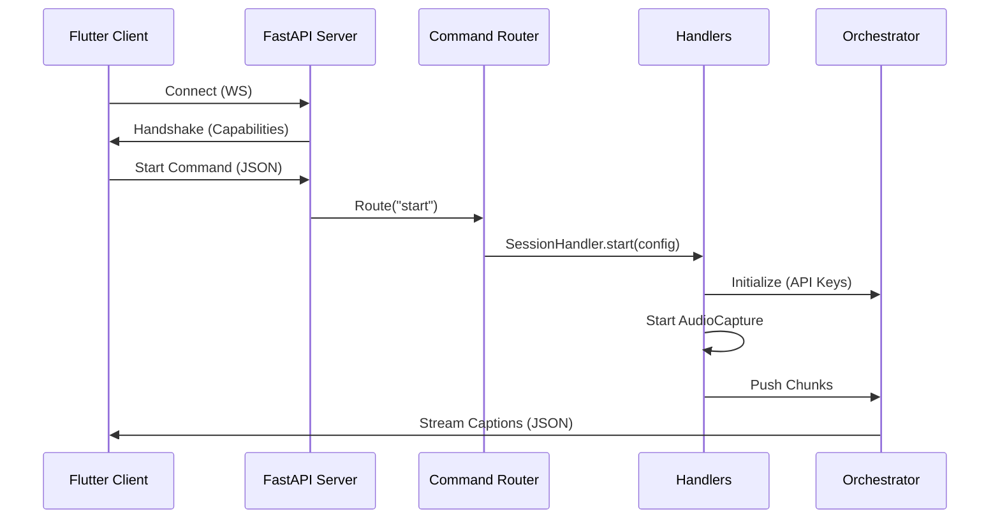

# Python Server Architecture

## Overview

The Python server is the local backend for Omni Bridge. It captures system audio (or microphone), runs ASR and translation, and streams results to the Flutter UI via WebSocket. 

The server uses an **Asynchronous Modular Architecture** built on **FastAPI** and **uvicorn**, allowing for high-concurrency WebSocket management and non-blocking command execution.

---

## Directory Structure

```
server/
├── src/
│   ├── audio/
│   │   ├── capture.py          # WASAPI loopback + mic capture (pyaudiowpatch)
│   │   ├── handler.py          # Audio status callbacks and broadcasting
│   │   ├── meter.py            # Real-time audio level monitoring
│   │   └── shared_pyaudio.py   # Shared PyAudio instance
│   ├── network/
│   │   ├── orchestrator.py     # Core pipeline & RateLimiter & Speech Polishing
│   │   ├── ws_manager.py       # WebSocket connection management
│   │   ├── router.py           # Command routing (Decouples WS from logic)
│   │   └── handlers.py         # Specialized command handlers (Session, Device, Config)
│   ├── utils/
│   │   └── server_utils.py     # structlog setup & process utilities
│   └── models/
│       ├── (ASR & Translation engines)
├── pyproject.toml              # Modern dependency management
├── flutter_server.py           # FastAPI Entry point & Handshake
└── requirements.txt
```

---

## Key Components

### `flutter_server.py`
The FastAPI-based entry point. It bootstraps the `ConnectionManager` and `CommandRouter`, and manages the WebSocket lifecycle.
- **Handshake**: Upon connection, the server sends a `capabilities` handshake containing details about available GPUs, Whisper model status, and authentication state.

### `src/network/router.py` & `handlers.py`
Separates the WebSocket communication layer from business logic.
- **Router**: Maps incoming JSON commands (`start`, `stop`, `settings`, `get_devices`, `volume`) to specific methods.
- **ServerContext**: Encapsulates all global state (orchestrator, capture, config) in a single object, passed to all handlers to avoid global variable pitfalls.
- **Specialized Handlers**:
  - `SessionHandler`: Manages audio session lifecycle (Start/Stop).
  - `ConfigHandler`: Handles real-time configuration updates and volume scaling.
  - `DeviceHandler`: Enumerates WASAPI and Loopback devices for the client.

### `src/network/orchestrator.py`
The core intelligence layer.
- **RateLimiter**: Implements dynamic RPM management for NVIDIA NIM (Riva/Llama) to prevent `429 Too Many Requests` errors.
- **Speech Polishing**: Uses `pysbd` (Python Sentence Boundary Disambiguation) to segment and deduplicate repetitive stutters or duplicated sentences before translation.
- **Capabilities Handshake**: Provides a structured report of system readiness (GPU availability, API validity).

### `src/utils/server_utils.py`
Provides centralized infrastructure.
- **Structured Logging**: Uses `structlog` to output machine-readable JSON logs for better observability and easier debugging.

---

## Data Flow



---

## Resilient Fallback Strategy

The `InferenceOrchestrator` implements a multi-layered fallback strategy to ensure service continuity:
1. **`google_api`** → Falls back to **`google` (Free)**.
2. **`riva`** → Falls back to **`llama`** or **`google`**.
3. **`google` (Free)** → Falls back to **`llama`** if scraping is blocked.

---

## Observability

The server now emits structured logs. Example:
```json
{
  "event": "asr_complete",
  "latency_ms": 150,
  "model": "riva",
  "text": "Hello world",
  "timestamp": "2026-03-15T..."
}
```
Logs are stored in `%LOCALAPPDATA%\OmniBridge\logs\server_debug.log`.
